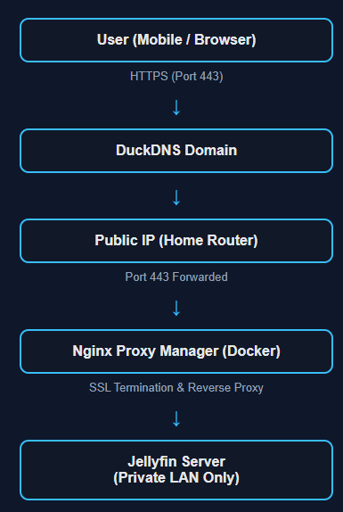
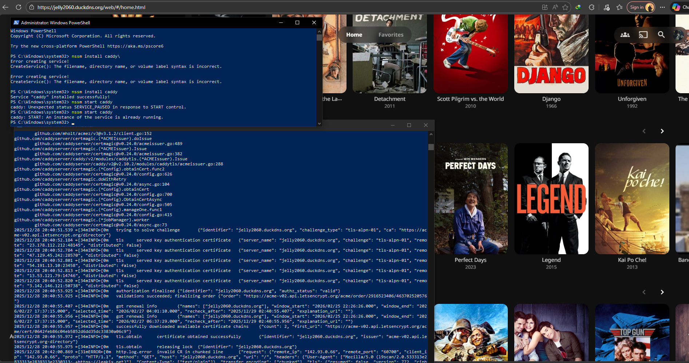
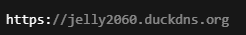
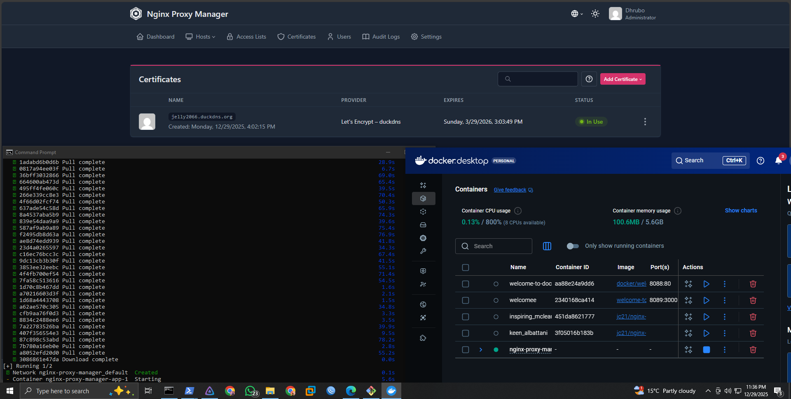
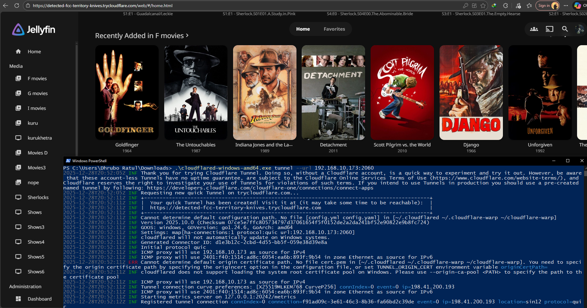
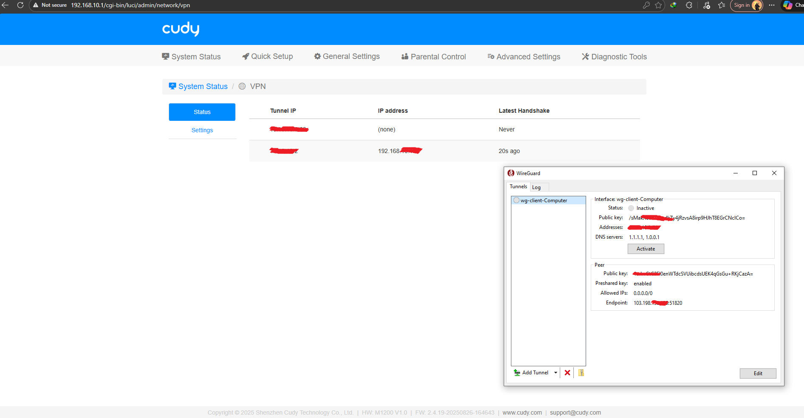
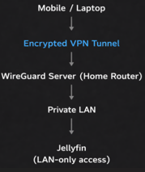

# 🚀 Project Overview:

- Built a secure self-hosted Jellyfin media server
- Implemented HTTPS using reverse proxy (Caddy / Nginx Proxy Manager)
- Avoided port forwarding risks using Cloudflare Tunnel
- Added private access using WireGuard VPN
- Simulated ISP networking (PPPoE, VPN, QoS) using MikroTik RouterOS

👉 Focus: Secure service exposure + real-world networking concepts

## 📌 Project Motivation:

I wanted to build a personal media server that I could access securely from anywhere, especially on my mobile device.
While my computer is mainly used for work and learning, my phone is my primary device for entertainment. This naturally led me to explore Jellyfin as a self-hosted alternative to cloud streaming services.

While working in a Network Operations Center (NOC) at an ISP, I often found myself asking:

How do real-world services like FTP servers, media servers, and VPNs remain reachable and secure from anywhere on the internet, while most home services stay limited to private networks?

Initially, I built my Jellyfin server only for local use.
However, I later wanted to watch movies during my free time at the office or while away from home. That’s when the idea of accessing my server securely from my mobile device outside my home network came to mind. I realized this was the perfect opportunity to move beyond theory and truly understand real networking concepts in practice.

This project became a problem-driven learning journey, not just a media server setup.

### 🎯 *Purpose of This Repository:*

This repository documents my hands-on exploration of how services are:

Exposed securely

Protected from common risks

Designed in ways similar to real ISP / NOC environments

Rather than following a single tutorial, this project reflects:

Real questions

Real mistakes

Real fixes

Gradual improvement over time

### 🧠 *What This Project Covers:*

This repository will progressively document my learning and implementation of:

- Self-hosting fundamentals

- Reverse proxies

- SSL/TLS and certificate handling

- DNS & Dynamic DNS

- Secure exposure using tunnels

- Docker-based service deployment

- VPN-based private access

- MikroTik RouterOS networking labs

Each topic is added step by step, following how the problems were discovered and solved in real life.

### 🛠️ *Technologies Used:*

* Jellyfin — Media Server

* DuckDNS — Dynamic DNS

* Cloudflare Tunnel — Secure outbound tunneling

* Caddy — Reverse Proxy (learning phase)

* Nginx Proxy Manager — Reverse Proxy with Docker

* Docker & Docker Desktop (WSL-based)

* WireGuard VPN — Private remote access

* MikroTik RouterOS — PPP, VPN, routing, firewall labs

### 📘 *Learning Philosophy:*

This is not a copy-paste tutorial project.

It is a problem-driven learning log, very similar to how issues are identified, tested, and solved in real NOC and ISP environments.

### 🧩 *Architecture:*

## 📅 Jellyfin LAN Validation & External Access Test:

### 🖥️ *Local Network Setup (LAN):*

Jellyfin was installed and configured within the local network:

Media libraries were added and indexed

Jellyfin was bound to a local IP

Accessed via the default port:

### 🌐 *External Access via Port Forwarding:*

To access Jellyfin from outside the home network, port forwarding was configured:

This made Jellyfin reachable from:

- Mobile data

- Office network

### ⚠️ *Key Security Observations:*

While port forwarding was simple, it introduced serious risks:

Jellyfin was directly exposed to the internet

Traffic was served over unencrypted HTTP

Open ports are easily discoverable by scanners

Increased risk of unauthorized access and brute-force attacks

## 📅 Reverse Proxy & HTTPS (Why SSL Matters):

🔁 What Is a Reverse Proxy?

A reverse proxy sits in front of backend services and handles incoming client requests, forwarding them internally. and acts as an intermediary between users and the backend service.

### 🔐 *Why HTTPS (SSL/TLS) Is Critical:*

Serving Jellyfin over HTTP means:

* Login credentials are sent in plain text

* Traffic can be intercepted

* Sessions can be hijacked

HTTPS solves this by:

* Encrypting all traffic

* Verifying server identity

* Protecting credentials and streams

Modern HTTPS relies on TLS certificates (commonly referred to as SSL/TLS)

### ⚙️ *What I Tried:*

At this stage, I experimented with using a reverse proxy in front of Jellyfin:

* Jellyfin continued running on a private LAN IP

* The reverse proxy handled:

  * Incoming HTTPS traffic

  * SSL certificate issuance

  * Forwarding requests internally to Jellyfin

This immediately improved the security posture:

* Jellyfin was no longer directly exposed

* All external traffic was encrypted

* Access was routed through a single controlled entry point

### 🖥️ *Caddy Reverse Proxy:*

What’s happening here:

* Caddy is installed and managed using NSSM (Non-Sucking Service Manager)
  → This allows Caddy to run persistently as a Windows background service.

* Caddy automatically requests an SSL/TLS certificate from Let’s Encrypt for:

* The logs show:

  * Successful ACME TLS-ALPN challenge

  * Certificate issuance and validation

  * HTTPS being enabled without manual certificate configuration

Jellyfin is now accessible securely via:

* All external traffic is:

  * Encrypted (HTTPS)

  * Terminated at Caddy

  * Safely forwarded to Jellyfin running on a local private IP

# 📅 Docker & Nginx Proxy Manager:

### 🐳 *Why Docker?*

Docker allows applications to run in isolated containers while sharing the host system’s resources.

* Docker was used to run Linux-based services on Windows (via WSL) in isolated containers.
  This allowed clean, reproducible deployment without using virtual machines.

Docker does not emulate hardware.
It runs applications directly using the host’s CPU, memory, and storage.

### 🔍 *Why Docker Made Sense Here:*

* Reverse proxy software is typically Linux-based

* My system is Windows

* Docker (with WSL) allows Linux services to run cleanly on Windows without:

  * Dual booting

  * Virtual machines

  * System pollution

Using Docker meant:

* Easy start/stop of services

* Clear separation between applications

* Predictable and repeatable configuration

### 🧱 *Introducing Nginx Proxy Manager:*

Instead of configuring raw Nginx manually, I chose:

→ Nginx Proxy Manager

### ⚙️ *How It Was Deployed:*

* Docker Desktop was installed and running

* Nginx Proxy Manager was deployed using Docker

* Required ports were bound (80 / 443)

* Data was persisted using Docker volumes

## 📅 Cloudflare Tunnel:

Cloudflare Tunnel creates an outbound, encrypted connection from your local machine to Cloudflare’s network.

Instead of:

* Opening ports on your router

* Letting the internet connect into your home

### ⚙️ *What I Tested:*

* Created a Cloudflare Quick Tunnel

* Exposed Jellyfin using a temporary Cloudflare URL

* Verified access from:

  * Mobile data

  * External networks

### ⚠️ *Limitations Discovered:*

🔗 Temporary URLs

* Quick Tunnels generate temporary domains

* Not suitable for long-term use

## 🧭 Final Architecture Summary

Public Access:
* User → Cloudflare Tunnel / Reverse Proxy → Jellyfin (Docker) → Local Network

Private Access:
* User → WireGuard VPN → Home Network → Jellyfin

## 📅 WireGuard VPN:

### 🔐 *Why Add a VPN?*

Some services are best kept private, even if they are secure:

* Admin panels

* Management dashboards

* Internal services

* Personal-only media access

Exposing these publicly increases attack surface unnecessarily.

A VPN allows access as if the device were inside the home network, without exposing the service to the internet.

### 🧩 *What Is WireGuard?*

WireGuard is a modern VPN protocol designed to be:

* Lightweight

* Fast

* Secure by default

* Easy to audit

Unlike older VPNs, WireGuard uses:

* Strong cryptography

* Minimal configuration

* Simple peer-based connections

### 🔁 *Traffic Flow:*

### ⚙️ *How I Used It:*

WireGuard server was configured on the home router

Client profiles were created for remote devices

Devices connected securely over the internet

# 🔧 MikroTik RouterOS Labs

### 🧪 Lab Environment & Tools Used:

All MikroTik labs in this repository were performed in a virtualized environment to safely simulate real-world network scenarios without affecting production systems.

### 🖥️ *Virtualization Platform:*

* VMware® Workstation 17 Pro

Used to create isolated virtual networks and run multiple routers simultaneously for:

* Client–server labs.

* Site-to-site VPN testing.

* Traffic shaping and routing experiments.

### 🌐 *Router Operating System:*

MikroTik RouterOS (CHR)

* Image used: chr-7.18.2.ova

The Cloud Hosted Router (CHR) version of RouterOS was used because:

* It provides full RouterOS functionality.

* Ideal for lab environments.

* Widely used for training and certification practice.

* Supports advanced features (PPP, VPN, QoS, Firewall, Routing).

## 📅 PPTP (Site-to-Site VPN Basics)

📌The objective of this lab is to understand the fundamentals of site-to-site VPN connectivity using PPTP (Point-to-Point Tunneling Protocol).

→ This lab demonstrates how two separate private networks can communicate securely over the internet using a VPN tunnel

### 🧩 *Lab Topology:*

* One router acts as HQ (PPTP Server).

* One router acts as Branch (PPTP Client).

* Both routers run MikroTik RouterOS (CHR) in a virtual lab

### ⚙️ *What Was Configured:*
On the HQ Router (PPTP Server)

* PPTP server enabled.

* PPP profile configuration.

* User authentication (PPP Secrets).

* IP address assignment for tunnel interfaces.

On the Branch Router (PPTP Client)

* PPTP client interface.

* Authentication credentials.

* Remote server connection.

* Routing to reach HQ network.

### 📂 *Configuration Files:*

The following exported RouterOS configuration files are included:

* HQ-pptp.rsc — PPTP server (HQ) configuration.

* Branch-pptp.rsc — PPTP client (Branch) configuration.

These files can be imported into RouterOS to reproduce the lab.

## 📅 PPPoE (ISP Authentication Basics)

The objective of this lab is to understand how ISPs authenticate users and assign IP addresses using PPPoE (Point-to-Point Protocol over Ethernet).

This lab simulates a real ISP access scenario, where:

* The ISP controls authentication.

* Users receive IP addresses dynamically.

* Bandwidth and access can be managed centrally.

### 🧩 *Lab Topology:*

* One router acts as a PPPoE Server (ISP side).

* One router acts as a PPPoE Client (User side).

* Both routers are running MikroTik RouterOS (CHR) in a virtual environment.

### ⚙️ *What Was Configured:*

On the PPPoE Server

* PPP profile

* IP address pool

* PPPoE server on Ethernet interface

* User authentication (PPP Secrets)

* Local and remote address assignment

On the PPPoE Client

* PPPoE client interface

* Username and password authentication

* Automatic IP address assignment from server

### 📂 *Configuration Files:*

The following exported RouterOS configuration files are included:

* PPPoE Server.rsc — PPPoE server configuration

* PPPoE Client.rsc — PPPoE client configuration

These files can be imported directly into RouterOS for testing

## 📅 SSTP (Secure VPN with Certificates)

The objective of this lab is to configure a secure VPN connection using SSTP (Secure Socket Tunneling Protocol) and understand how certificate-based authentication enhances VPN security.

This lab improves upon PPTP by introducing:

* Strong encryption

* HTTPS-based tunneling

* Certificate validation
  

### 🧩 *Lab Topology:*

One router acts as SSTP Server

Remote client connects using SSTP over TCP 443

Both routers run MikroTik RouterOS (CHR) in a virtual lab

Unlike PPTP, SSTP works over HTTPS (Port 443), making it firewall-friendly and secure.

### ⚙️ *What Was Configured:*
On the SSTP Server (RouterOS)

* Created a Certificate Authority (CA)

* Generated server certificate

* Signed certificate using CA

* Enabled SSTP server

* Configured PPP profile

* Created user authentication

On the Client Side

* Imported server certificate

* Configured SSTP client

* Provided authentication credentials

* Established encrypted tunnel

### 📂 *Configuration Files:*

The following configuration file is included:

* SSTP_configuration.rsc — SSTP server configuration

## 📅 Simple Queue & PCQ (Traffic Shaping & Fair Usage)

The objective of this lab is to understand how bandwidth management and traffic shaping work using Simple Queues and PCQ (Per Connection Queue) in MikroTik.

This lab simulates how ISPs:

* Control user bandwidth
* Prevent network congestion
* Ensure fair usage among multiple users

### 🧩 *Lab Topology:*
* One router acts as the gateway/router
* Multiple clients share the same internet connection
* Traffic is controlled using queues

All configurations were tested using MikroTik RouterOS (CHR) in a virtual lab.

### ⚙️ *What Was Configured:*
🔹 Simple Queue
* Bandwidth limits per user/device
* Upload and download control
* Target IP-based queue rules
🔹 PCQ (Per Connection Queue)
* Automatic bandwidth distribution
* Fair sharing across multiple users
* Dynamic allocation based on active connections
🔹 Additional Settings
* Queue types (PCQ upload/download)
* Max limit configuration
* Queue hierarchy (basic)

### 📂 *Configuration Files:*

The following configuration files are included:

→ simple queue R1.rsc  basic queue setup (Router 1)

→ simple queue R2.rsc extended queue setup (Router 2)

→ PCQ.rsc — PCQ configuration

These files can be imported into RouterOS to replicate the lab.

## 📚 Key Learnings

- Risks of exposing services using port forwarding
- Importance of HTTPS and SSL/TLS certificates
- Practical use of reverse proxies in real deployments
- Difference between public exposure vs private VPN access
- Hands-on experience with ISP concepts using MikroTik (PPP, VPN, QoS)

## ✅ Conclusion

This project started as a simple media server setup but evolved into a practical exploration of secure service exposure and real-world networking concepts.

It helped me understand how production-like systems are designed, secured, and accessed — similar to real NOC and ISP environments.

I plan to continue improving this setup by exploring more advanced security, automation, and scalable infrastructure.

## 👤 Author

Dhrubo Ratul Basak,
Computer Engineering Graduate | Networking & AI Enthusiast
